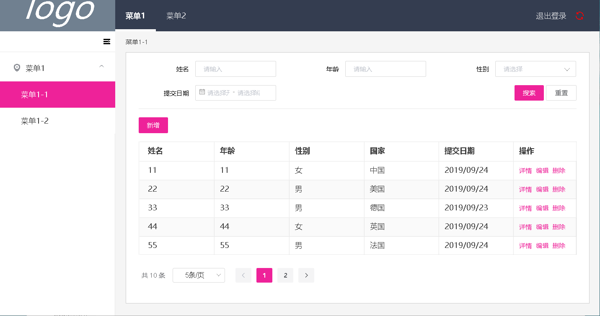
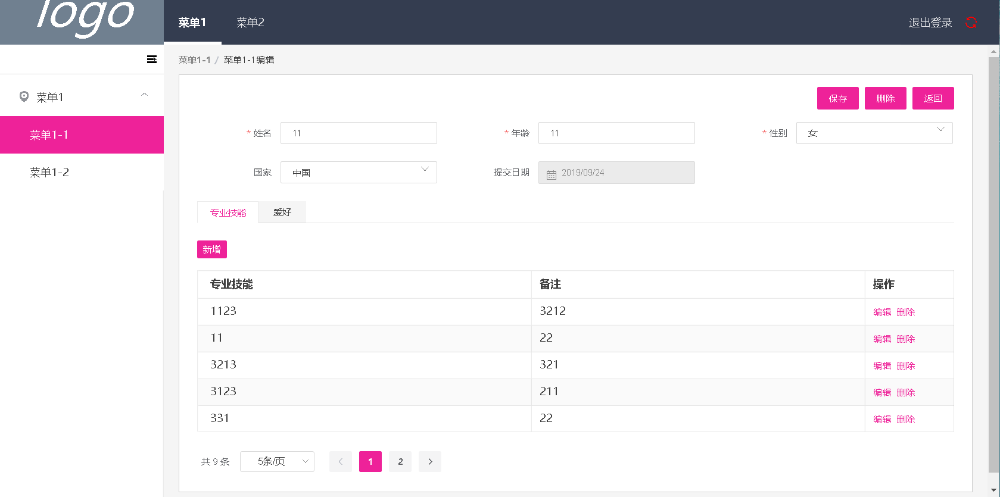

# vue3.0 demo 


### 技术栈
```
vue element i18n axios
```
## Project setup
```
yarn install
```
### Compiles and hot-reloads for development
```
yarn run serve
```
### Compiles and minifies for production
```
yarn run build
```
### src目录结构
```
    src
    ├─assets
    │  ├─style            ----全局样式
    │  └─images
    ├─components
    │  ├─bread-crumb      ----面包屑组件
    │  ├─lang-select      ----切换语言组件
    │  ├─left-nav         ----左侧导航栏组件
    │  ├─template-render  ----自定义组件******************************
    │  │  ├─components    ----自定义小组件
    │  │  └─pages         ----自定义页面（列表页、详情页）
    │  └─top-nav          ----头部导航栏组件
    ├─data                ----select数据
    ├─mixins              ----全局方法
    ├─plugins             ----插件
    │  ├─ajax             ----axios封装
    │  ├─element-ui       ----element配置
    │  ├─i18n             ----多语言配置
    │  │  └─langs         ----翻译内容
    │  ├─popConfirm       ----确认弹框
    │  └─regex            ----自定义校验规则
    ├─views               ----页面
    │   ├─login           ----登录页面
    │   ├─main            ----登录页面
    │   ├─one             
    │   │  ├─meau1
    │   │  │  ├─config    ----menu1-1页面参数配置文件 *****************
    │   │  │  └─pages     ----menu1-1页面(列表、详情) *****************
    │   │  └─meau2       
    │   └─two             
    ├─App         
    ├─main
    ├─router
    └─store
```
### 列表页实现示例--详情见代码
```
<template>
    <div>
        <list-render ref="list" :config="config"></list-render>
    </div>
</template>
<script>
import config from '../config/list'; // 列表页配置参数
export default {
    data () {
        return {
            config: config
        }
    },
    methods: {
        toDeatil(row) { // 自定义方法
 
        }
    }
}
</script>
-------------------------------------------------
const config = {
    diaTitle: { //新增、编辑的自定义title，可不写
        add: '新增信息',
        edit: '编辑信息'
    },
	cols: [{ //搜索、列表、新增、编辑的数据
        key: 'name',
        search: true,
		label: '姓名'
    }],
    
    btns: {
        add: true //快捷写法-已定义常用的才可以这样使用
    },

    opes: {
        edit: true
    },

    rule: {
        type: 'on', // on(校验) off(不校验) all(全部校验，不用写下面index: '')
        index: '0 1 2' //对应下标
    },

    api: { // 接口
        $list: '/users/list'
    }
};

export default config;
```
### 详情页实现--详情见代码
```
<template>
    <div>
        <detail-render ref="detail" :config="config"></detail-render>
    </div>
</template>
<script>
import config from '../config/detail'; // 详情页配置参数
export default {
    data () {
        return {
            config: config
        }
    },
    methods: {
        detail_remove() { // 自定义
        }
    }
}
</script>
---------------------------------------------
import cols from './_detail_cols';
import skill from './_detail_skill'; 同列表页参数
import live from './_detail_live'; 同列表页参数

const config = {
	cols: cols, // 头信息

	tabs: [skill, live], // 页签数据

	rule: { // 头信息的校验--编辑
		type: 'on',
		index: '0-2'
	},

	api: {
		$detail: '/users/detail'
	},

	edit: { //编辑页置灰项
		form: {
			disabled: [4]
		}
	},

	btns: {
		save: {
			detailShow: 'edit'
		}
	}
};

export default config;
```